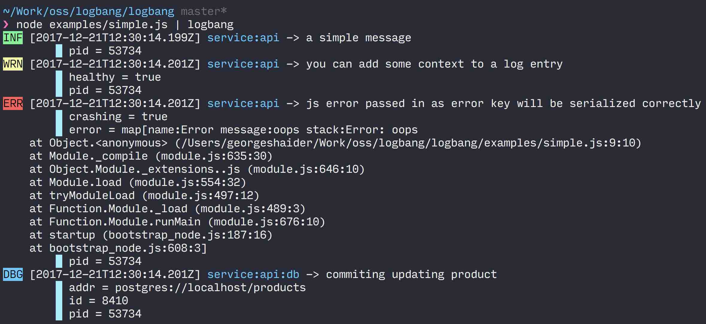

  

# logbangcli

logbang (aka log!) is a set of libraries for simple, structure logging. Any program that emits log events to stdout can be piped into this CLI to produce a human friendly output. This is useful during development or when reading through logs.

The following screenshot shows a program that write log events using the javascript logbang library. Its output is piped to this CLI app which converts the JSON log lines into indented and colorized output.

## Install

You can download the latest release of logbangcli from the Github releases page for this project: [https://github.com/logbang/logbangcli/releases](https://github.com/logbang/logbangcli/releases)
